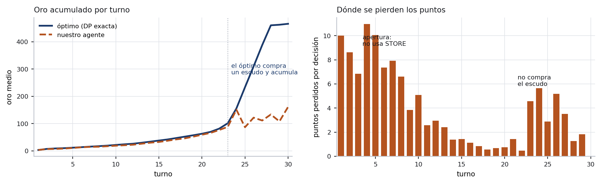

# Gold Dice RL — cuánto vale saber la respuesta

**Trabajo Práctico 1 — Aprendizaje por Refuerzos — Inteligencia Artificial y Neurociencias**

---

## 1. Antes de entrenar: cuánto hay para ganar

Casi todos los informes de este TP van a decir algo como *"nuestro agente sacó X, el baseline
sacó Y"*. El problema es que ese par de números no dice si X es bueno. ¿Faltaban 10 puntos o 300?

Así que empezamos por otro lado: **resolvimos el juego exacto**.

La clave es que `points` no aparece en ninguna transición de `env.py`. No afecta la tirada, ni
los costos, ni la tormenta: solo se acumula. Entonces el valor de un estado no depende de los
puntos, y de las nueve variables de la observación quedan cuatro que importan —turno, oro,
dados, bonus— más los escudos. `roll_sum` ya está sumado al oro cuando toca decidir, y
`stored_value` se pliega en la transición.

Eso deja un problema chico. Con inducción hacia atrás desde el turno 30 (donde la respuesta es
trivial: el oro se evapora, así que se puntúa todo), y con la distribución conjunta exacta de
`(suma, máximo)` de *n* dados calculada por convolución, sale el número:

> **El juego vale 642.45 puntos esperados jugado perfecto.**

Verificado de dos maneras: la programación dinámica predice 642.45, y hacer jugar esa política
2.000 partidas simuladas da 645.7 ± 2.9. Coinciden.

A este solver lo llamamos **el oráculo**. No es un agente de aprendizaje y no se entrega al
torneo: es la vara. Sirve para tres cosas que sin él son imposibles: un denominador honesto,
saber *en qué turnos* falla el agente aprendido, y separar habilidad de suerte.

Y reencuadra el problema de entrada: **`SimpleExpectancy`, el baseline "inteligente" de la
cátedra, captura el 53 % del juego. Deja casi la mitad sobre la mesa.**

## 2. Estado, acciones, recompensa

**Acciones.** El ambiente ofrece `SCORE` paramétrica: con 400 de oro hay 401 acciones `SCORE`
distintas. Nuestra hipótesis inicial fue que colapsarla era el error caro del enfoque tabular.
La medimos volviendo a resolver el juego con el espacio mutilado a propósito. Con `k` libre el
óptimo vale 642.45; **dejando solo `SCORE(oro)` vale exactamente lo mismo**. Costo cero, porque el
juego óptimo puntúa una sola vez —en el turno 30— y puntúa todo. El control negativo confirma que
la medición discrimina: prohibir "puntuar todo" y dejar solo la mitad baja el óptimo a 641.33.
Trabajamos entonces con seis acciones discretas, y esa reducción está medida, no supuesta.

**Estado.** No aprendemos `Q(estado, acción)` sino `V(afterstate)`: el valor del estado
**posterior a la acción**. En este juego el efecto de una acción es completamente determinista
—pagar 42 de oro y sumar un dado es aritmética— y todo el azar viene después. Cuando pasa eso,
conviene aprender el afterstate (Sutton & Barto §6.8; es la representación de TD-Gammon).
Muchos pares (estado, acción) distintos caen en el mismo afterstate y comparten experiencia, y
`roll_max` desaparece del estado aprendido.

El afterstate es `(turno, oro, dados, bonus, escudos)`. El oro va en una **grilla no uniforme
con interpolación lineal**: de a 1 entre 0 y 96, donde viven todos los umbrales de compra (4, 5,
8, 16, 18, 24, 26, …, 82, 90), y cada vez más gruesa arriba, donde no hay umbrales. Con buckets
comunes, 41 y 42 de oro caen en la misma celda y el agente no distingue "puedo comprar el dado"
de "no puedo".

**Recompensa.** La nativa, sin modificar: los puntos al puntuar. Lo que sí cambiamos es la
**parametrización del valor**:

    V(f) = Φ(f) + R(f),   con   Φ = oro + guardado + escudos·5 + turnos_restantes · dados · (3.5+bonus)

y la tabla guarda `R`, no `V`. Φ es contabilidad: caja, más activos a valor de costo, más el
ingreso futuro si no se compra nada más. La razón es de señal contra ruido: el retorno de un
episodio tiene desviación típica de ~130 puntos, y las decisiones de los primeros turnos valen
1 o 2. Aprender `V` directo es medir 1 punto adentro de 130 de ruido. Φ absorbe la parte grande
y predecible; sobre `R` las mismas muestras rinden muchísimo más. Es *reward shaping* basado en
potencial (Ng, Harada & Russell, 1999) escrito como reparametrización, así que la política
óptima no cambia: Φ mueve el punto de partida de la búsqueda, no su destino.

## 3. Algoritmo e hiperparámetros

Control TD off-policy sobre afterstates —Q-Learning, escrito sobre otro espacio— con **Double
learning** (van Hasselt, 2010): dos tablas, una elige la mejor acción y la otra la valúa.

Lo agregamos porque la versión de una sola tabla **empeoraba con más entrenamiento**: 81.0 % del
óptimo a 250 mil episodios, 80.0 % a 500 mil, 79.5 % a 750 mil. Eso no es ruido, es monótono.
Es sesgo de maximización: el objetivo es un `max` sobre valores estimados con ruido, y el máximo
de variables ruidosas supera sistemáticamente al máximo de sus medias. El sesgo se concentra en
los estados poco visitados, y la política greedy se deja arrastrar hacia ellos.

| Hiperparámetro | Valor | Por qué |
|---|---|---|
| γ | **1** | Horizonte finito, fijo y conocido: no hay nada que descontar. Con γ=0.995 el pago del turno 30 se multiplica por 0.865, en un juego cuyo único cobro grande es ese. |
| α | `máx(0.002, (1+visitas)^−0.5) × 0.015` | Robbins-Monro **por peso**. Un α global obliga a elegir entre aprender rápido lo frecuente y aprender bien lo raro. |
| ε | 0.15 → 0.02 lineal en el 60 % del entrenamiento | Barrido de 11 configuraciones; más exploración empeora. |
| λ | **0** | Probamos trazas de elegibilidad (λ = 0.3, 0.5, 0.9). Todas empeoraron. |
| episodios | hasta 3 × 10⁶ | Mejor checkpoint según la banda de desarrollo; el máximo cae cerca de 4 × 10⁵ (§6). |

Semillas: el entrenamiento usa un rango disjunto de las tres bandas de evaluación.

## 4. Resultados

n = 20.000 episodios, intervalo de confianza al 95 %, banda de desarrollo.

| Agente | Media | IC 95 % | % del óptimo |
|---|---|---|---|
| Oráculo (DP exacta, *no compite*) | 644.10 | [642.2, 646.0] | 100.3 % |
| **Nuestro agente** | **527.06** | [525.2, 529.0] | **82.0 %** |
| Solo el potencial Φ (cero aprendizaje) | 490.41 | [488.0, 492.8] | 76.3 % |
| Q tabular clásico, rangos amplios + `SCORE_ALL` | 364.21 | [363.7, 364.7] | 56.7 % |
| **`SimpleExpectancy` (cátedra)** | **343.40** | [342.0, 344.8] | **53.5 %** |
| Q tabular clásico, topes chicos, γ=0.995 | 314.58 | [314.1, 315.1] | 49.0 % |
| Q tabular clásico, topes chicos, γ=1 | 292.63 | [292.0, 293.2] | 45.5 % |
| TD sobre afterstates **sin** Φ | 105.06 | — | 16.4 % |
| `RandomLegal` (cátedra) | 63.03 | [62.5, 63.6] | 9.8 % |

**Sin sobreajuste.** Todas las decisiones se tomaron mirando una sola banda de semillas. Medido
en las tres, el agente final da 527.06 (desarrollo, donde se decidió todo), 526.27 (control,
mirada una sola vez) y 525.42 (pública, la del enunciado). La diferencia entre desarrollo y
control es +0.80 con error estándar 1.37: ruido.

Un detalle metodológico que cambia cómo se leen estas tablas: en `env.py` un **único** generador
sirve los dados y las tormentas, y `rng.choice(size=num_dice)` consume una cantidad que depende
de la política. Desde el primer turno en que dos agentes difieren en cantidad de dados, sus
flujos de azar se desincronizan. **No existen números aleatorios comunes en este ambiente**, y no
se pueden conseguir sin tocar `env.py`. Con n = 1000 y σ ≈ 100 el intervalo mide ±6.3: una
diferencia de 4 puntos en el leaderboard no es una diferencia. Por eso usamos n = 20.000.

## 5. Ablaciones: qué costó cada decisión

Mismo presupuesto (400 mil episodios), cambiando una cosa por vez.

| Cambio | De | A | Δ |
|---|---|---|---|
| Topes `dados≤5, bonus≤4, oro≤240` → rangos que cubren el juego óptimo | 292.6 | 354.8 | **+62.2** |
| `SCORE` de `{TODO, MITAD}` → `{TODO}` | 354.8 | 364.2 | +9.4 |
| γ de 0.995 → 1, **con rangos amplios** | 354.6 | 354.8 | +0.2 (nulo) |
| γ de 0.995 → 1, **con topes chicos** | 314.6 | 292.6 | **−21.9** |
| Tabla Q discretizada → afterstates + Φ + Double | 364.2 | 527.1 | **+162.9** |
| Potencial Φ apagado → encendido | 105.1 | 527.1 | **+422.0** |

**Los topes cuestan 62 puntos.** El juego óptimo llega a 9 dados, bonus 8 y 797 de oro; el 38 %
de sus decisiones ocurren con más de 5 dados. Con esos topes, todo el endgame —donde se decide el
70 % del puntaje— cae en una sola celda de la tabla. El agente no aprende mal: no puede ver.

**γ<1 solo ayuda cuando la representación está rota**, y es la fila más interesante. Con rangos
amplios, γ=0.995 y γ=1 son indistinguibles; con topes chicos, γ=0.995 es 22 puntos **mejor**. Si
la representación no distingue el endgame, la política correcta es inexpresable y ser miope es lo
mejor disponible — y el descuento hace miope al agente. O sea que γ<1 estaba **tapando una falla
de representación**, no resolviendo un problema de horizonte. Quien mire solo el número concluye
"γ=0.995 anda mejor" y se lleva la lección al revés.

Y la descomposición incómoda, que reportamos porque es verdad: de los 527 puntos, **490 vienen del
diseño de la representación y 37 del aprendizaje**. Sin el control "Φ solo" le habríamos atribuido
al algoritmo un mérito que es del modelado. El inverso también importa: apagar Φ hunde al agente a
105, así que la representación sin aprendizaje tampoco alcanza.

## 6. Qué no funcionó, y por qué

Faltan 116 puntos hasta el óptimo. Con el oráculo se puede calcular el **arrepentimiento** exacto
de cada jugada —`V*(s) − [r + E V*(s')]`, cero si la jugada es óptima— y ver dónde están.

El error dominante es no comprar el escudo del turno 23: el agente termina con 0.01 escudos de
media contra 0.73 del óptimo, y por eso acumula 183 de oro final contra 484. Es un **óptimo local
de política**: el escudo solo rinde si después acumulás, y acumular solo conviene si tenés
escudo. Salir de ahí exige cambiar dos decisiones a la vez, y ε-greedy explora desviaciones de un
paso. Probamos tres esquemas pensados para eso —ε por episodio estilo Ape-X, ε-z-greedy con
exploración temporalmente extendida (Dabney et al., 2020), y ε alto sostenido— y **ninguno lo
rompió**.

Pero la causa de fondo se ve mirando los valores. En ese estado el óptimo separa la mejor acción
de la peor por **13.6 puntos sobre un valor de 600: un 2.3 %**, y el error de estimación del
agente es de 18 a 29 — más grande que la diferencia entera que tiene que detectar. **El agente no
razona mal: su función de valor es correcta al 4 % y la decisión pide 2 %.** Con σ ≈ 130, resolver
13.6 puntos pide del orden de 1.400 muestras independientes por par de estados y el agente tiene
~250 por peso: falta un factor de seis.

Eso es una predicción falsable, así que la probamos de las dos maneras. **Una falló.** Subir los
episodios de 1.5 a 5 millones no mejoró nada —el agente se estanca en 81 % y después baja—;
achicar la grilla de 173 a 114 nodos sí ayudó, pero +3.1 puntos, no el salto que predecía la
cuenta. El cuello no es *cuántas* muestras hay sino **de dónde vienen**: los estados que importan
—turno 24, mucho oro, un escudo puesto— se visitan solo cuando la exploración compra el escudo, y
al turno siguiente la política greedy vuelve a no acumular. Triplicar los episodios triplica unas
muestras que nunca contienen la continuación correcta. Es *exploración profunda*, y la cuenta de
tamaño de muestra lo pasaba por alto porque supone muestras representativas.

## 7. Casos borde del ambiente

Cuatro cosas que están en `env.py` y no en el enunciado, y que cambian la estrategia.

**La tormenta cae después de tu acción**, así que los puntos son inmunes y solo se toca el oro que
decidiste no puntuar: el oro es efectivo arriba de la mesa, los puntos son plata en el banco, y el
ladrón pasa después de tu movida. Corolario medido: gastar un turno cuesta `0.075 × oro` (22.76
puntos con 300 de oro) — y **con un escudo, 0.04**.

**El turno 30 no tiene tirada después**, así que todo el oro sin puntuar se evapora y comprar
cualquier cosa ahí es tirar oro. No lo hardcodeamos: en la formulación por afterstates el valor de
cualquier estado del turno 30 es 0, y el `argmax` elige `SCORE(todo)` solo.

**`STORE_BEST_DIE` clona el dado, no lo guarda**: la suma de la tirada ya se cobró, y la acción
paga 4 para volver a cobrar el dado más alto el turno siguiente. Es la acción más usada del juego
óptimo. Y **las semillas no son comparables entre agentes** (§4), el caso borde más caro si se
ignora, porque invalida cualquier comparación fina.

Ninguna de las piezas anticipa por separado la estrategia óptima: construir barato con
`STORE_BEST_DIE` hasta el turno 13, comprar dados hasta el 22, **un** escudo en el 23 —uno solo,
porque en 7 turnos se espera ~1.05 tormentas— y acumular detrás de ese muro hasta cobrar 463 de
oro de una sola vez en el turno 30.

## 8. Qué sigue y qué aprendimos

**Qué sigue.** El experimento de §6 dice dónde apretar y dónde no: más episodios no sirve. Lo que
falta es cubrir estados que la política actual no visita. Dos caminos concretos: exploración
profunda con funciones de valor aleatorizadas (Osband et al.), que genera desviaciones coherentes
de varios pasos en vez de una sola; y aproximación de función con rasgos que generalicen entre
`(dados, bonus)` vecinos en lugar de una celda por combinación, para que el valor del estado con
escudo se aprenda en parte desde estados parecidos sin tener que visitarlo.

**Qué aprendimos.** Tres cosas, en orden de cuánto nos sorprendieron.

Primero: **resolver el juego antes de entrenarlo cambió todo el trabajo.** No porque el oráculo
diera la respuesta —no se entrega—, sino porque convirtió cada opinión en una medición. Nuestra
hipótesis inicial sobre `SCORE` era falsa y lo supimos en diez minutos en vez de en tres días.

Segundo: **el techo lo puso la representación, no el algoritmo.** 490 de 527 puntos vienen de
cómo está escrito el estado. Y el caso de γ muestra el corolario feo: un hiperparámetro puede
"funcionar mejor" justamente porque compensa un error estructural, y el número solo no lo delata.

Tercero, y es lo que menos esperábamos: **el agente no fallaba por no entender el juego, sino por
no tener precisión suficiente.** Estaba a 28 puntos de la respuesta correcta sobre un valor de
600; donde las acciones difieren en 2 %, aprender es un problema de estimación antes que de
razonamiento. De ahí salió la lección de método: hicimos dos predicciones cuantitativas sobre cómo
cerrar esa brecha y **una falló**. Que fuera falsable es lo que la hizo útil — su fracaso
identificó la causa real, qué estados se visitan y no cuántas veces, mucho más rápido de lo que lo
habría hecho seguir probando hiperparámetros.
